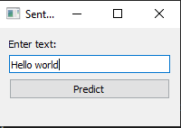
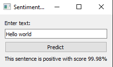

# An example of ML Application with the pretrained model and test.

An example of English text tone detection with [Hugging Face](https://huggingface.co/) library.

Example can be used by script main.py

# Tests GitHub Actions

This repository also contains tests. Tests can be seen in script test_main.py.

# Using user interface for sentiment analysis

1. Install all required libraries from requirements.txt
2. Launch script pyqt_app.py
3. Enter text for analysis in app
   
   

4. Press button "Predict" and get your results

   
